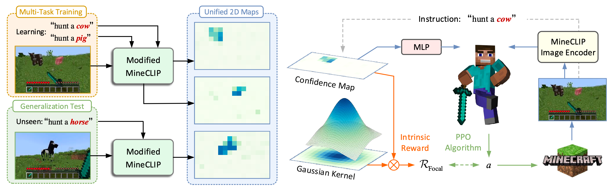
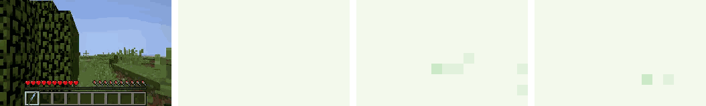
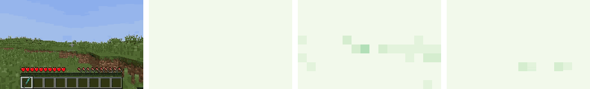

# Visual Grounding for Object-Level Generalization in Reinforcement Learning

Code for paper "Visual Grounding for Object-Level Generalization in Reinforcement Learning" accepted by **ECCV 2024** [[PDF]](https://arxiv.org/abs/2408.01942).



Overview of our proposed **C**LIP-guided **O**bject-grounded **P**olicy **L**earning (**COPL**). (*left*) **Visual grounding**: The instruction (*e.g.* "hunt a cow") is converted into a unified 2D confidence map of target object (*e.g.* cow) via our modified [MineCLIP](https://arxiv.org/abs/2206.08853). (*right*) **Transfering VLM knowledge into RL**: The agent takes the confidence map as the task representation and is trained with our proposed focal reward derived from the confidence map to guide the agent toward the target object. 

### Installation

* Create a conda environment with `python 3.9` and install Python packages in `requirements.txt`.
* Install `jdk 1.8.0_171`. Then install our modified [MineDojo](https://github.com/PKU-RL/MCEnv_COPL) environment.
* Download pre-trained models for MineCraft: run `bash downloads.sh` to download the MineCLIP model.

### Training

To train single-task RL for hunting a sheep with focal reward: 

Run `./scripts/sheep_focal.sh 0`, where 0 is the random seed. `--multi_task_config` in the script specifies the task and it can be changed to other config files in `src/config/env/single_task` to train RL for other tasks, such as hunting a cow and hunting a pig.

To train COPL for hunting domain: 

Run `./scripts/hunt_copl.sh 0`, where 0 is the random seed. `--multi_task_config` in the script specifies the task domain and it can be changed to `src/config/env/multi_tasks/harvest.json` to train COPL for harvest domain.

### Demos

Here we present some videos of agents performing hunting tasks trained using COPL, as well as confidence maps for different objects given by our modified MineCLIP. From left to right: **raw video**, confidence maps for **cow**, **sheep**, and **pig**, respectively.

| hunt a cow       |  |
| ---------------- | :----------------------------------------------------------: |
| **hunt a sheep** |  |
| **hunt a pig**   |  |

### Citation

If you find our work useful in your research and would like to cite our project, please use the following citation:

```latex
@inproceedings{jiang2024visual,
      title={Visual Grounding for Object-Level Generalization in Reinforcement Learning}, 
      author={Jiang, Haobin and Lu, Zongqing},
      booktitle={European Conference on Computer Vision (ECCV)},
      year={2024},
}
```
